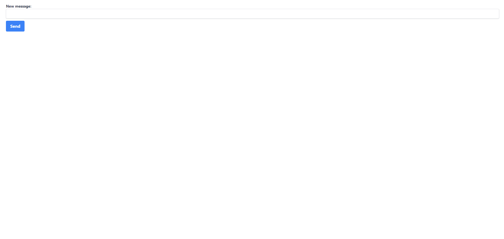

# Full Stack Message App



## Overview

📝 Web application where a user can send a message and see a list of all messages sent.

## Technologies Used

🛠️ List the technologies and frameworks used in the project.

- Backend: [Go](https://golang.org/)
- Frontend: [Next.js](https://nextjs.org/)
- Typescript: [TypeScript](https://www.typescriptlang.org/)
- TailwindCSS: [TailwindCSS](https://tailwindcss.com/)

## Getting Started

⚙️ Instructions to get the project up and running on a local machine.

### Prerequisites

- [Go](https://golang.org/doc/install)
- [Node.js](https://nodejs.org/en/download/)

### Installation

1. Clone the repository.
   ```bash
   git clone https://github.com/your-username/project-name.git
   ```
2. Install backend dependencies.
   ```bash
   cd backend
   go mod download
   ```
3. Install frontend dependencies.
   ```bash
   cd message-app-frontend
   npm install
   ```
4. Start the backend server

   ```bash
   cd backend
   go run main.go
   ```

5. Start the frontend development server

   ```bash
   cd message-app-frontend
   npm run dev
   ```

## Contributing

🤝 Contributions are welcome! Please follow the guidelines in CONTRIBUTING.md.

## License

📜 Include your project's license information here.

## Acknowledgements

🙏 Give credit to any resources, libraries, or individuals whose code or work inspired your project.
